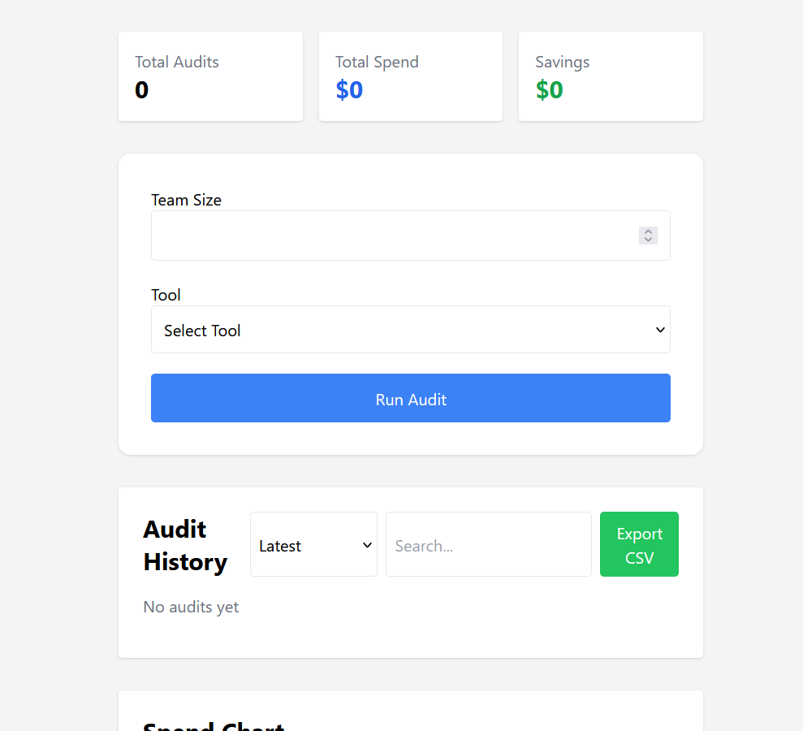
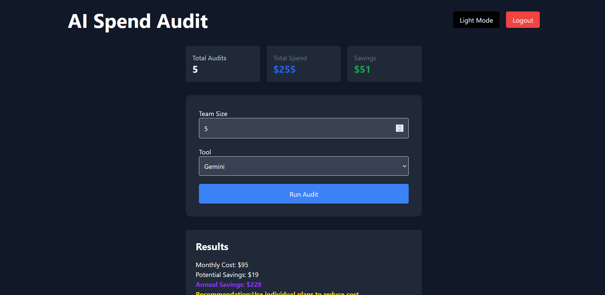
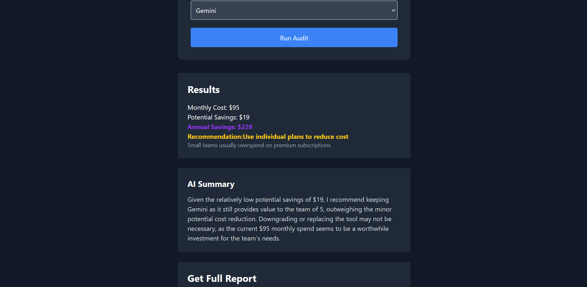
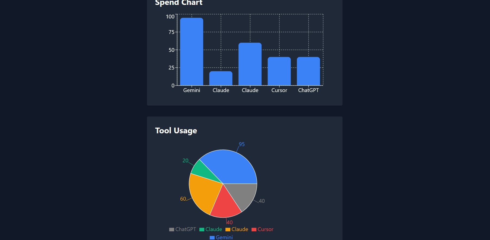
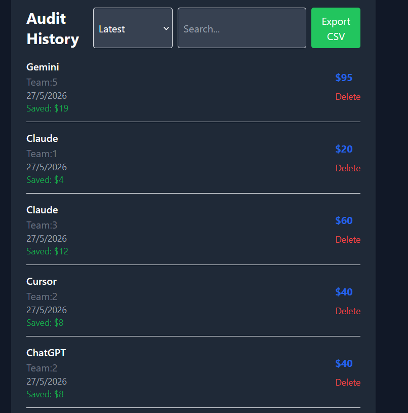

# AI Spend Audit Dashboard

AI Spend Audit Dashboard helps teams estimate AI tool spending, identify overspending, and generate optimization recommendations.

## Features

- AI spend calculation
- Monthly + annual savings estimation
- AI-generated summaries (Groq)
- Multiple tools support
  - ChatGPT
  - Claude
  - Cursor
  - Gemini
  - GitHub Copilot
  - Perplexity
  - Notion AI
- Audit history
- Search + sorting
- CSV export
- Charts (Bar + Pie)
- Dark mode
- Authentication (Supabase)
- Lead capture form
- Transactional email (Resend)
- AI recommendations
- Protected routes
- Custom middleware logging

---

## Tech Stack

Frontend:

- React
- Tailwind CSS
- Axios
- Recharts

Backend:

- Node.js
- Express.js
- Supabase
- Groq API
- Resend

Database:

- Supabase PostgreSQL

---

## Installation

Clone repo:

```bash
git clone https://github.com/ankushkumarcity960/credex-audit.git
cd credex-audit
```

Frontend:

```bash
cd client
npm install
npm run dev
```

Backend:

```bash
cd server
npm install
npm run dev
```

---

## Environment Variables

Server `.env`

```env
SUPABASE_URL=
SUPABASE_KEY=
RESEND_API_KEY=
GROQ_API_KEY=
CLIENT_URL=
```

Client `.env`

```env
VITE_SUPABASE_URL=
VITE_SUPABASE_ANON_KEY=
```

---

## Screenshots

### Dashboard (Light Mode)


### Dashboard (Dark Mode)


### AI Summary


### Charts


### Audit History


### Email Report


---

## Deployment

Frontend:
Vercel

Backend:
Render

Database:
Supabase

Email:
Resend

AI:
Groq API

## Demo Login

Email: test@gmail.com

Password: 12345678

## Live Demo

Frontend:
https://credex-audit-sepia.vercel.app

Backend API:
https://credex-backend-zhpg.onrender.com/api/health